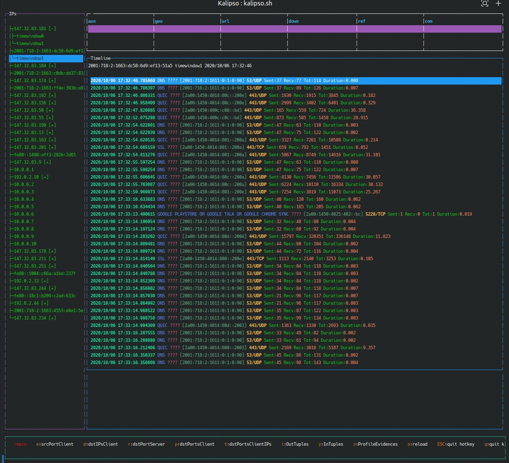

# Kalipso

Kalipso is the terminal user interface for [Slips](https://github.com/stratosphereips/StratosphereLinuxIPS). It provides an interactive view of Slips detections, profiles, time windows, flows, and evidence directly in the terminal.

Unlike the plain alert logs, Kalipso lets you inspect malicious and normal activity side by side, move through time windows, and drill down into the flows and evidence that caused a detection.



## Features

- Terminal-based interface for browsing Slips analysis output
- Colorful overview of IP profiles and their time windows
- Visual highlighting of malicious time windows
- Flow inspection for each selected profile and time window
- Evidence view for understanding why Slips raised a detection
- Support for choosing between multiple running Slips instances

## What Kalipso Shows

When connected to a running Slips instance, Kalipso shows:

- A list of IPs seen in the analyzed traffic
- Time windows for each IP profile
- Malicious time windows marked in red
- Normal time windows marked in green
- Flows belonging to the selected time window
- Evidence collected by Slips for that time window

For the selected IP, Kalipso can also display context such as ASN, geolocation, and VirusTotal score when available.

Slips groups detections into time windows, which are 1 hour long by default. A profile can therefore appear malicious in one window and normal in the next. Kalipso makes that distinction visible immediately.

## Using Kalipso

Kalipso is typically started while Slips is already running in another terminal.

```bash
./kalipso.sh /path/to/slips/running_slips_info.txt
```

If more than one Slips instance is running, Kalipso will prompt you to choose which Redis-backed session to open. The prompt looks like this:

```text
To close all unused redis servers, run slips with --killall
You have 3 open redis servers, Choose which one to use [1,2,3 etc..]
[1] wlp3s0 - port 55879
[2] dataset/test7-malicious.pcap - port 59324
```

After selecting an instance, Kalipso opens the corresponding interface.

## Navigation

- Use the arrow keys to move through IPs and time windows
- Press `Enter` on a time window to inspect its flows
- Press `Tab` to switch between the main view and the flows view
- Review the bottom evidence pane to see the detections that contributed to the alert

This makes it easier to understand not only that a profile was marked malicious, but also which concrete observations led to that conclusion.

## Running With Docker

If Slips is running inside Docker, open a shell in the container and start Kalipso there:

```bash
docker ps
docker exec -it <container_id> bash
./kalipso.sh /path/to/slips/running_slips_info.txt
```

## Requirements and Installation

Kalipso depends on Node.js and npm packages. In the Slips documentation, the recommended baseline is Node.js greater than version 12.

Example installation flow used in the Slips docs:

```bash
curl -fsSL https://deb.nodesource.com/setup_21.x | sudo -E bash -
sudo apt install -y --no-install-recommends nodejs
cd kalipso
npm install
```

Kalipso is normally installed and run as part of the larger Slips environment rather than as a completely standalone tool.

## About

Kalipso was developed at the Stratosphere Laboratory at the Czech Technical University in Prague as part of the Slips ecosystem.
